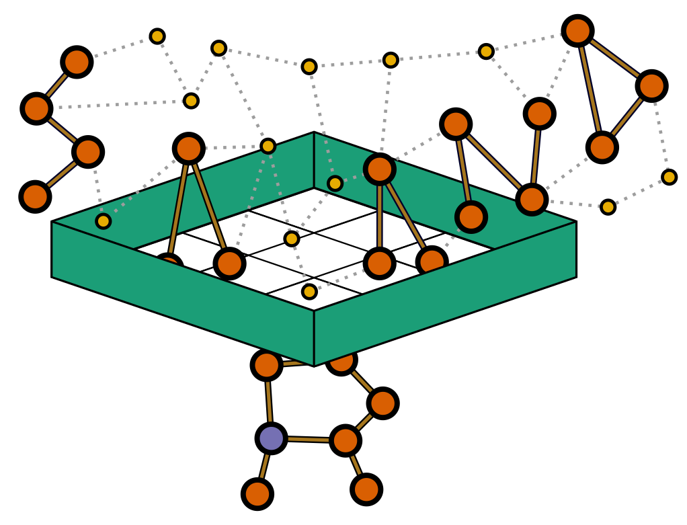

# Documentation for Sarand


This document provides an overview of how Sarand can be installed and used. It attempts to document all necessary details to set up the tool, and provides some run guides.

## Overview
Sarand can be used to extract the neighborhood of the target Antimicrobial Resistance (AMR) genes from the assembly graph.
It can also be used to simulate sequence reads from some reference genomes (through ART), run MetaSPAdes to assemble the simulated reads and then reconstruct the neighborhood of the AMR genes.




## Installation
### Step I: install the dependencies
Our tool relies on dependencies, including Python, Prokka, RGI, BLAST, Bandage, MetaSPAdes (in case the assembly graph has not already been generated) and ART (in case of simulating reads).
The most straight forward way to install this tool's dependencies is using bioconda.
#### Cloning the tool repository
`git clone https://github.com/beiko-lab/sarand`

Now, move to sarand directory (You should see setup.py there!).
#### Installing bioconda
Make sure [bioconda](https://bioconda.github.io/user/install.html) has been installed and the channels are set properly as follows.
```
conda config --add channels defaults
conda config --add channels bioconda
conda config --add channels conda-forge
```
#### Create a new conda environment

`conda env create -f conda_env.yaml`

Links to repositories of the main tool dependencies can be found here:
- prokka: https://github.com/tseemann/prokka
- RGI: https://github.com/arpcard/rgi
- Bandage: https://rrwick.github.io/Bandage/
- ART: https://www.niehs.nih.gov/research/resources/software/biostatistics/art/

Note: In case, prokka can't be installed through bioconda, I suggest using the docker
container [staphb/prokka](https://hub.docker.com/r/staphb/prokka) by the following command:
`docker pull staphb/prokka:latest`. Please note that PROKKA_COMMAND_PREFIX variable in your config (YAML) file need to be updated with an appropriate value which is probably an empty string (the default) unless Prokka is run through docker.  

#### Installing python requirements
Note: Make sure that you are in the root directory of this tool (sarand).

    conda activate sarand
    pip install .

### Step II: Testing
#### Available modules
Three modules are available under Sarand that can be run separately:  
- full_pipeline: It provides the complete pipeline to extract AMR neighborhood from the assembly graph and annotate it.
- find_ref_amrs: This module can be used to find all AMRs available in the reference genomes (fasta files) and extract their neighborhood sequences and annotate them. It is used as the ground truth when reference genomes are available.
- find_contig_amrs: This module is used to find the neighborhood of AMRs in a contig file, compare them with that of the reference genomes (if available) and calculate the sensitivity and precision.
Each of these modules can be run by

      sarand <module_name> -C <config_file>

#### Setting config file
To run Sarand, you need to have a config file as the input. Sample config files for all three modules with the list of all parameters that can be set have been provided as sample_config_full_pipeline.yaml, sample_config_find_ref_amrs.yaml and sample_config_find_contig_amrs.yaml.

Please note that the config file is a mandatory parameter. However, you don't need to set all the parameters available in the config file (probably the main one you want to set is main_dir).

Make sure to update the following parameter in your config file:
- main_dir: the address of the main directory to read inputs and store results.
- PROKKA_COMMAND_PREFIX: Only ih you use docker to run Prokka, set this parameter with the command from docker (e.g., `docker pull staphb/prokka:latest`))

Note: you might also need to update the following parameters in your config file to provide the path to Bandage, ART and SPAdes, in case they have not been installed via conda.
- BANDAGE_PATH (the path to access bandage executable file)
- ART_PATH (the path to access art_illumina directory)
- SPADES_PATH (the path to spades.py)

Note: You don't need to install and set the parameters for ART and SPAdes if the assembly graph is provided as an input.

#### Running the test code
To run the code, make sure you are in the created conda environment.
To activate it, run:

    conda activate sarand

and then run the code by:

    sarand full_pipeline

#### Expected results
All results will be available in test directory (mostly in output_dir).
Here is the list of important directories and files that can be seen there and a short description of their content.
- metagenome.fasta: a file containing all ref genomes.
- metagenome_1.fq and metagenome_2.fq: reads simulated by ART from metagenome.fasta
- AMR_info: if reference genomes are available, this directory contains the list of identified AMR sequences, their extracted neighborhood and annotation.
  - AMR_info/sequences/:The sequence of identified AMRs is stored here, with a name similar to their original name (file name is generated by calling `code/utils.py::restricted_amr_name_from_modified_name(amr_name_from_title(amr_original_name)))`
  - AMR_info/ref_annotations/: the annoation details are stored here.
  - AMR_info/AMR_ref_neighborhood.fasta: all extracted neighborhood sequences are stored in this file.
  - AMR_info/ref_neighborhood_annotations.csv: the summary of annotation info is stored in this csv file.
- spade_output: This directory contains metaSPAdes assembly outputs. The most important files are `assembly_graph_with_scaffolds.gfa` and `contigs.fasta`.
- sequences_info/sequences_info_{params.seq_length}/: This directory stores the information of extracted neighborhood sequences from the assembly graph.
  - sequences_info/sequences_info_{params.seq_length}/sequences/: the extracted sequences in the neighborhood of each AMR are stored in a file like `ng_sequences_{AMR_NAME}_{params.seq_length}_{DATE}.txt`.
  For each extracted sequence, the first line denotes the corresponding path, where the nodes representing the AMR sequence are placed in '[]'.
  The next line denotes the extracted sequence where the AMR sequence is in lower case letters and the neighborhood is in upper case letters.
  - sequences_info/sequences_info_{params.seq_length}/paths_info/: The information of nodes representing the AMR neighborhood including their name, the part of the sequence represented by each node (start position and end position) as well as their coverage is stored in a file like `ng_sequences_{AMR_NAME}_{params.seq_length}_{DATE}.csv`
- annotations/annotations_{params.seq_length}: The annotation details are stored in this directory.
  - annotations/annotations_{params.seq_length}/annotation_{AMR_NAME}_{params.seq_length}: this directory contains all annotation details.
    - prokka_dir_extracted{NUM}_{DATE}: it contains the output of prokka for annotation of a sequence extracted from the neighborhood of the target AMR gene in the assembly graph.
    - rgi_dir: contains RGI annotation details for all extracted neighborhood sequences of the target AMR gene.
    - annotation_detail_{AMR_NAME}.csv: the list of annotations of all extracted sequences for an AMR gene
    - trimmed_annotation_info_{AMR_NAME}.csv: the list of unique annotations of all extracted sequences for an AMR gene
    - coverage_annotation_{GENE_COVERAGE_THRESHOLD}_{AMR_NAME}.csv:
    the list of the annotations in which the gene coverage difference from the AMR gene coverage is less than GENE_COVERAGE_THRESHOLD value.
    - vis_annotation.csv: this csv file contains the annotations of extracted sequences from both ref genomes and the graph and is used for visualization
    - gene_comparison_<AMR_NAME>.png: An image visualizing annotations
  - annotations/annotations_{params.seq_length}/not_found_annotation_amrs_in_graph.txt: the list of all AMRs available in the reference genomes but not identified in the graph.
- evaluation/evaluation_{params.seq_length}/summaryMetrics_up_down_{GENE_COVERAGE_THRESHOLD}_{DATE}.csv: This csv file contains the calculated precision and sensitivity for all AMRs comparing the sequences extracted from the graph with those of the ref genomes.  

## Exploring the code
### Optional parameters to set
The list of all parameters that can be set in the modules of Sarand has been provided in the sample config files (sample_config_full_pipeline.yaml, sample_config_find_ref_amrs.yaml and sample_config_find_contig_amrs.yaml).

### Python files
#### 1- full_pipeline.py
This is the core file to do all the steps available in our tool including concatenating ref genomes in a single file, simulating reads, assembling reads, extracting amr neighborhood, annotating amr neighborhood sequences and evaluation (in case that ref genomes are available).

To run, make sure that parameters are set in code/params.py:

`python code/full_pipeline.py`

#### 2- extract_neighborhood.py
This is the main file to extract the neighborhood of an AMR gene from an assembly graph.

To run:

```
python code/extract_neighborhood.py --amr/-A <AMR gene file path in FASTA format>
--gfa/-G <GFA assembly graph>
--length/-L <length of the linear sequence around AMR gene to be extracted (default = 1000)>
--main_dir <the output directory to store the results>
```
#### 3- find_amrs_in_sample.py
This code is used to find all AMRs available in a metagenome sample, extract their neighborhood sequences and annotate them.

To run:
```
python code/find_amrs_in_sample.py --db <metagenome file path>
    --seq <fasta file containing all AMR sequences>
```
Note: it reads 3 parameetrs from params.py:
- params.PROKKA_COMMAND_PREFIX
- params.use_RGI
- params.RGI_include_loose

#### 4- amr_neighborhood_in_contigs.py
This code is used to find the neighborhood of AMRs in a contig file, annotate them, compare them with that of the ref genomes and calculate the sentivity and precision.

To run:

`code/python amr_neighborhood_in_contigs.py`
NOTE: It reads required parameters from code/params.py and the most important parameters need to be set correctly there, are:
- params.seq_length
- params.contig_file
- params.amr_identity_threshold
- params.amr_files
- params.ref_ng_annotations_file
- params.main_dir

NOTE: The result are available in the following directory:
`params.main_dir+'contigs_output_'+<params.seq_length>`

#### 5- annotation_visualization.py
This file is used to visualize sequences annotations.

To run:
```
python annotation_visualization.py --csvfile <annotation file path>
    --title <the image title> --output <the output image name>
```
